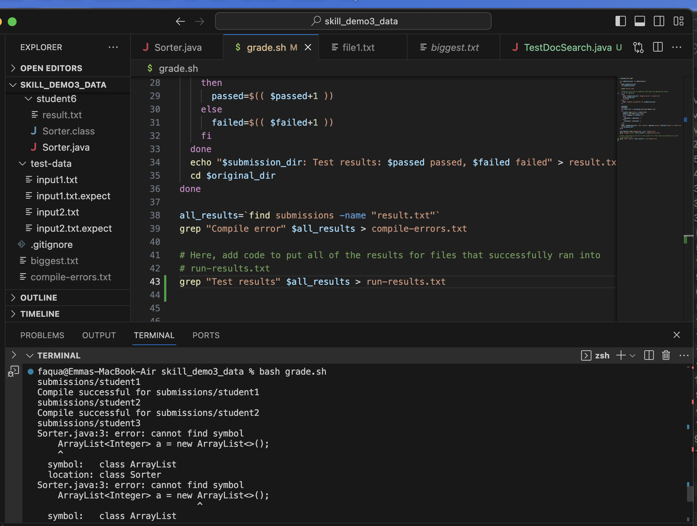

# cse15l-lab-reports5
### Emma Nguyen - PID A18021060

1. Part 1 - Debugging Scenario
   Design a debugging scenario, and write a report as a conversation on Edstem:
   - [a] The origional post from a student with a screenshot showing a symtom and a description of a guess at the bug/some sense of what the failure-inducing input is: "Hi, I am using `bash` command to run `grade.sh` in `skill_demo3_data`, but I don't see anything written in `run-result.txt` file. Could you check my code `grade.sh` see where I did it wrong?"
   - 
   - 
   
   - [b] A response from a TA asking a leading question or suggesting a command to try: "Could I see your `compile-errors.txt` file after you run `grade.sh`?
        
        - The `compile-errors.txt` file shows that the code works.
        - Another response from a TA: "So, the code words with command `grep "Compile error" $all_results > compile-errors.txt` but does not work with `grep "test results" $all_results > run-results.txt`. What do you think? Which one should you check on this command? What `all_result` variable is about?"
   - [c] Another screenshot/terminal output showing what information the student got from trying that, and a clear description of what the bug is.
        - After the student got the response with some leading questions from the TA, he looked back on the `grep "test results" $all_results > run-results.txt` and checked the `result.txt` content. He realized that there was a typo in the phrase `test results` (with the "T" in `Test` should be uppercase -> correct one: `Test results`). He fixed the bug which is the command line now become `grep "Test results" $all_results > run-results.txt`.
      
     Here is the screenshot running the code after fixing the bug which is the command line `grep "Test results" $all_results > run-results.txt`.
      
     Here is `all_result.txt` file with all test results information after fixing the bug and re-run the code.
   - [d] At the end, all the information needed about the setup:
      - The file and directory structure needed: https://github.com/ucsd-cse15l-f23/skill_demo3_data
      - The contents of each file before fixing the bug.
     `grade.sh`

     ```
        original_dir=`pwd`
        for submission_dir in submissions/*
     do
        echo $submission_dir
        cd $submission_dir

        javac Sorter.java

        #Replace this with a condition that does the appropriate check
        if [[ $? -ne 0 ]] 
        then
          echo "$submission_dir: Compile error" > result.txt    
          cd $original_dir
          continue
        else
          echo "Compile successful for $submission_dir"
        fi

        passed=0
        failed=0
        for test_file in $original_dir/test-data/*.txt
        do
          result=`java Sorter < $test_file`
          expect=`cat $test_file.expect`
          if [[ $expect == $result ]]
          then
            passed=$(( $passed+1 ))
          else
            failed=$(( $failed+1 ))
          fi
        done
        echo "$submission_dir: Test results: $passed passed, $failed failed" > result.txt
        cd $original_dir
      done

      all_results=`find submissions -name "result.txt"`
      grep "Compile error" $all_results > compile-errors.txt

      # Here, add code to put all of the results for files that successfully ran into run-results.txt
      grep "test results" $all_results > run-results.txt
   ```
      `run-results.txt`
     
   ```   (empty file)
   ```
     
   - The full command line (or lines) I ran to trigger the bug: `grep "test results" $all_results > run-results.txt`.
   - A description of what to edit to fix the bug: The bug was a typo in command line `grep "test results" $all_results > run-results.txt`, instead of `"test results"`, it should be `"Test results"` (change the `test` to `Test` with `T` is an uppercase). Because `"Test result"` is the phrase that we need to look for in `result.txt`. So the correct command is `grep "Test results" $all_results > run-results.txt`.

1. Part 2 - Reflection
   - I've learned many useful and cool things from the lab tasks and lab reports from the second half of this quater. They are `bash script`, `vim editor`, `git`, `gitHub`, `jdb`, etc., which I was very interested in. Even though I used a little bit `vim editor`, `git` commands, `gitHub` in my previous classes, but I was struggling in understanding and using them correctly. Thank to this class, I understand more and know how to develop my knowledge in using these tools. It is very cool to know how to use `jdb` in debugging and `bash cript` in running java and other command lines which I did not know before. In addition, it is always a cool thing to know how to use gitHub to create my own `pages site`. I also thank to the tutors for helping me do lab tasks and find the way to debug. Overall, I found this class is extremely useful and necessary for any programmer.

